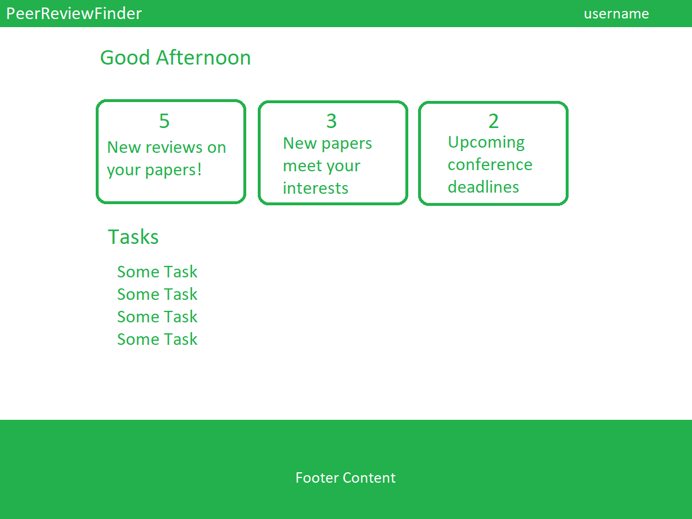
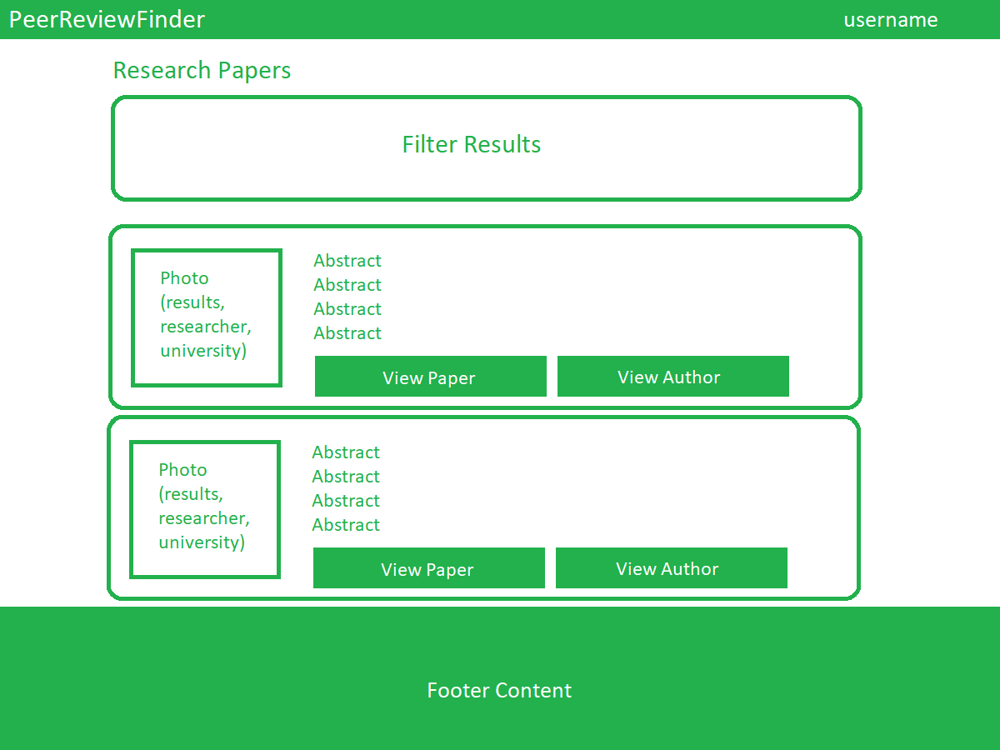

 
## Table of Contents
 

* [Overview](#overview)
* [Peer Review Finder](#covid-check)
* [User Manual](#user-manual)
* [The Team](#the-team)

## Overview
The problem: Journal editors and conference chairs find it increasingly difficult to find reviewers for publication manuscripts. At the same time, researchers receive an overwhelming number of invitations to review papers.

The solution: We propose a platform that better matches papers for review with potential reviewers by pooling researchers with similar interests together. Editors/chairs can post abstracts in need of review and researchers can select abstracts of papers they’d like to review.

## Peer Review Finder

## User Manual
## Landing Page
New users are first taken to a landing page.  Here users see a brief description of features within the application.  A Login link is provided on the top right of the page to allow existing users to login with their profile or for new users to register and setup a profile setup page.   

## User Home Page

## Listing Page

## The Team
- [Yiwen Chen](https://yiwenc22.github.io/)
- [Derrick Luyen](https://derrickluyen.github.io/)
- [Kolwin Dixon](https://k-l-dixon.github.io/)
- [John Dobbs](https://john-dobbs.github.io/)
- [Aditi Jaiswal](https://jaiswal-aditi.github.io/)
