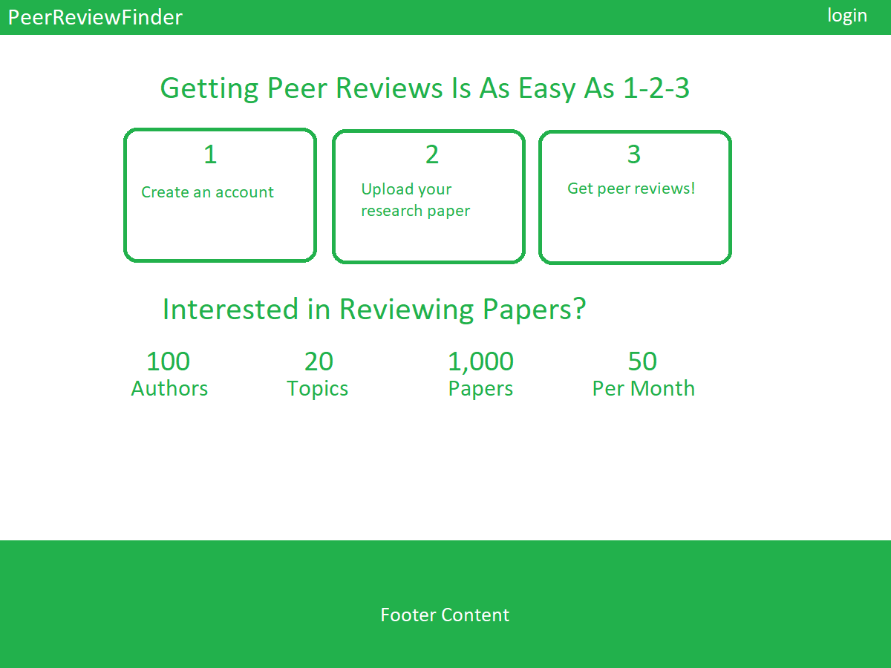

## Table of Contents
* [Overview](#overview)
* [Peer Review Finder](#covid-check)
* [User Manual](#user-manual)
* [The Team](#the-team)

## Overview
The problem: Journal editors and conference chairs find it increasingly difficult to find reviewers for publication manuscripts. At the same time, researchers receive an overwhelming number of invitations to review papers.

The solution: We propose a platform that better matches papers for review with potential reviewers by pooling researchers with similar interests together. Editors/chairs can post abstracts in need of review and researchers can select abstracts of papers they’d like to review.

## Peer Review Finder

## User Manual
## Landing Page
New user goes to landing page, registers, gets profile setup page, completes profile.

## User Home Page

## Listing Page

## The Team
- [Yiwen Chen](https://github.com/yiwenc22)
- [Derrick Luyen](https://github.com/derrickluyen/)
- [Kolwin Dixon](https://github.com/k-l-dixon)
- [John Dobbs](https://github.com/john-dobbs)
- [Aditi Jaiswal](https://github.com/jaiswal-aditi)
