# Table of Contents

* [About Peer Review Finder](#about-peer-review-finder)
* [Deployment](#deployment)
* [User Guide](#user-guide)
* [Developer Guide](#developer-guide)
* [Project Team](#project-team)


# About Peer Review Finder

* [Live Demo](https://peer-review-finder.xyz)
* [GitHub Organization](https://github.com/peer-review-finder)
* [Team Contract](https://docs.google.com/document/d/129I7p6RzvGBnGv6KCANo64H4_rCuaIOBxddQX1s_jI8/edit?usp=sharing)
* [Project Board Milestone 1 (Completed)](https://github.com/peer-review-finder/Source-Code/projects/1)
* [Project Board Milestone 2 (Completed)](https://github.com/peer-review-finder/Source-Code/projects/2)
* [Project Board Milestone 3 (In Progress)](https://github.com/peer-review-finder/Source-Code/projects/3)

## The Problem

Journal editors and conference chairs find it increasingly difficult to find reviewers for publication manuscripts. At the same time, researchers receive an overwhelming number of invitations to review papers.


## The Solution

We propose a platform that better matches papers for review with potential reviewers by pooling researchers with similar interests together. Editors/chairs can post abstracts in need of review and researchers can select abstracts of papers they'd like to review.


# Deployment

We are using DigitalOcean for deployment of this application.

[Live Demo](https://peer-review-finder.xyz)


# User Guide

The following sections describe the main features of this application as of Milestone 2.


## Landing Page

New users are first taken to a landing page.  Here users see a brief description of features within the application.  A Login link is provided on the top right of the page to allow existing users to login with their profile or for new users to register and setup a profile page.


## Login Page

Clicking on the Login link and then on the Sign In menu item, you will be directed to the page pictured below. On this page, users can log in to Peer Review Finder to access the web application.

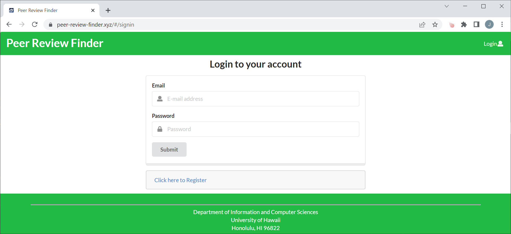


## Register Page

Clicking on the Login link and then on the Sign Up menu item, you will be directed to the page pictured below. On this page, new users can sign up and create a Peer Review Finder account. 

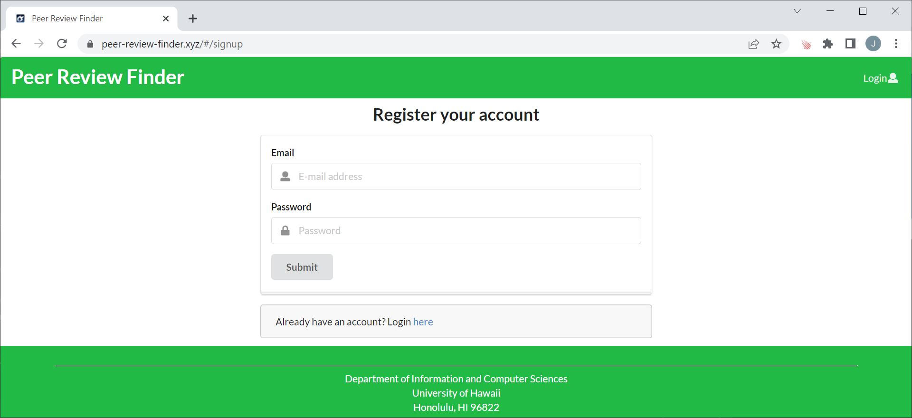


## Landing Page After Login (General User)

A successful login brings users to the following page below. Here, users have access to the many different functionalities as explained in the sections below.


## Profile Page

After logging in to your Peer Review Finder account, clicking on your email in the navbar on the top right of the page prompts a dropdown to show up. If you click on View Profile, you will be redirected to your profile page. From here, you can view your profile and you can also edit your profile by clicking on the Edit Profile button.

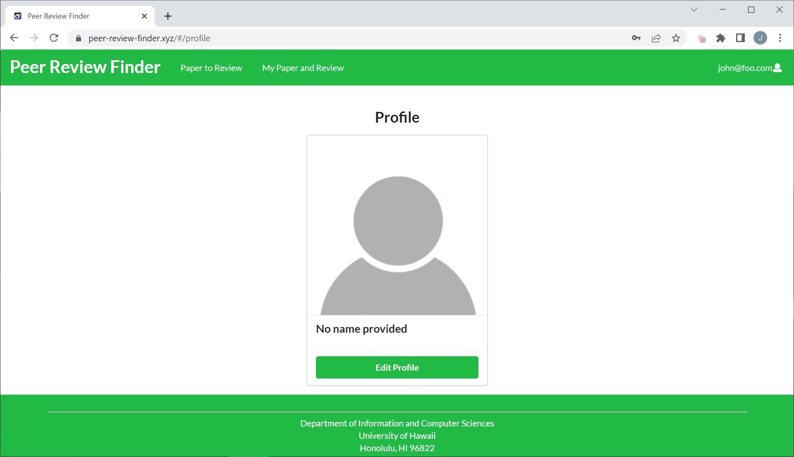


### Edit Profile Page

After clicking on the Edit Profile button, you will be redirected to the page below where you can edit your Peer Review Finder profile which consists of your name, your profile image, and your interests. After you have finished, you can press submit to save your changes and from there, you will be redirected to your profile page.

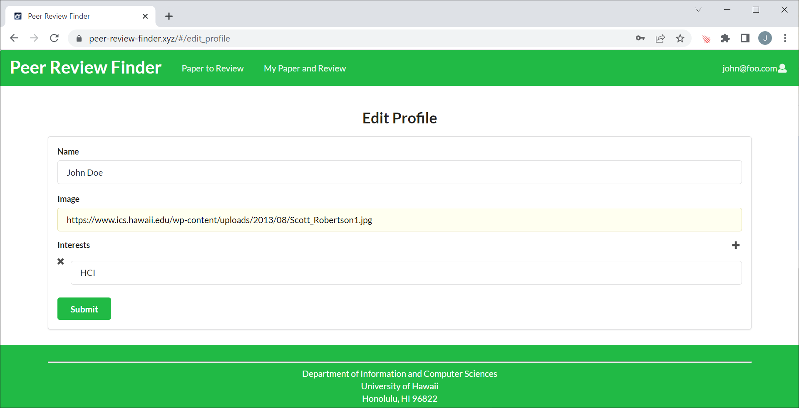


## Paper Listing Page (All Users)

By clicking "Paper to Review" in the NavBar, users are able to see papers that are available to review.  Papers available are listed with a brief abstract along with a link to view each paper and an "Upload Paper" button to the right and under the search bar.

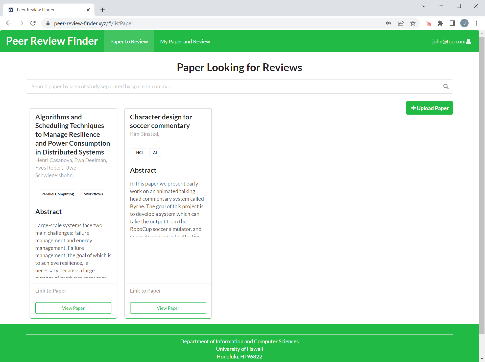


## Add Paper Page (All Users)

Clicking the "Upload Paper" button on the [Paper Listing page](#paper-listing-page-all-users) allows users to add a new paper to the Peer Review Finder database to allow other users to view and review the paper.

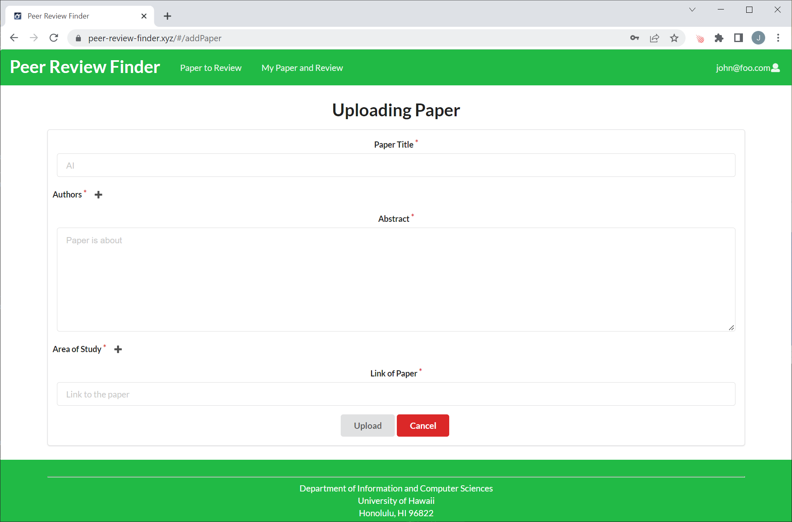


## View Paper Page (All Users)

Clicking the "View Paper" button on the [Paper Listing page](#paper-listing-page-all-users) for a specific paper allows users to see a full abstract of that paper along with a link to download the full paper. 

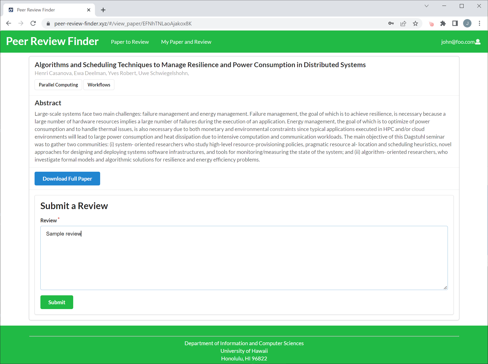

This page also allows users to review the particular paper by typing in the review textbox and then pressing the submit button to submit the review to the database.

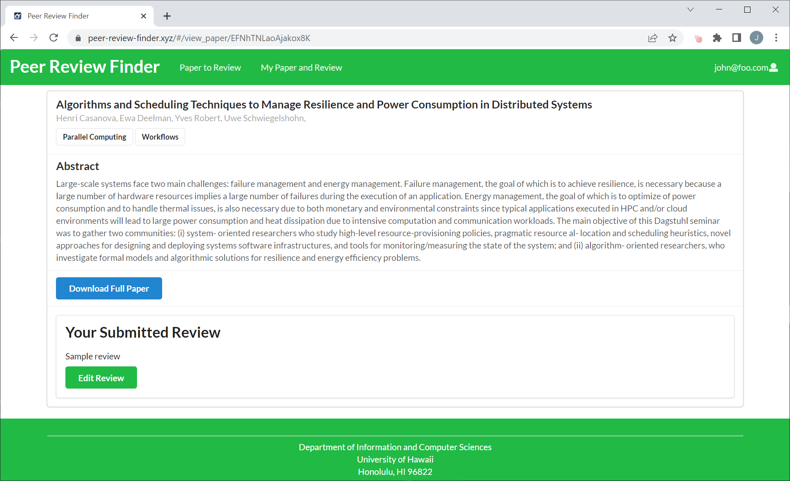

After submitting the review, users are also allowed to edit the review, should they feel the need to make changes to their review for a certain paper.


## My Papers and Reviews Page (All Users)

By clicking "My Paper and Review" in the NavBar, users are able to see their own papers as well as peer reviews on their papers.  They can also upload papers to the Peer Review Finder database via the upload paper near the top right of the page. Users can also view, edit, and delete their papers.

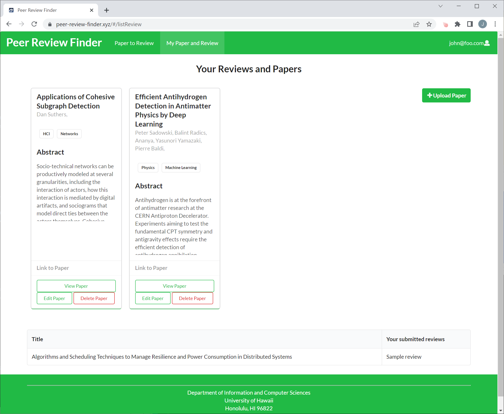


## View Paper Reviews (Paper Owner)

By clicking on the View Paper button on the Paper and Review page, users are able to view a listing of reviews left on their paper.

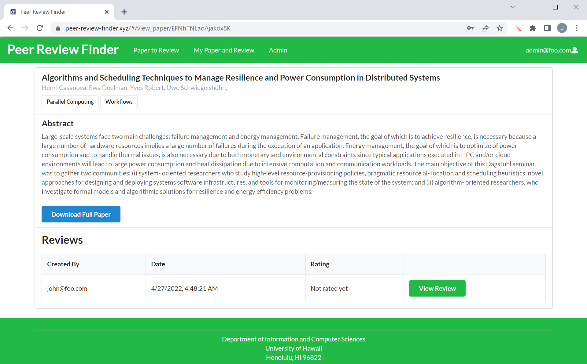


## Edit Paper Page (Paper Owner)

By clicking on the edit paper button on the Paper and Review Page, users are able to edit their papers and upload the changes after they are done.

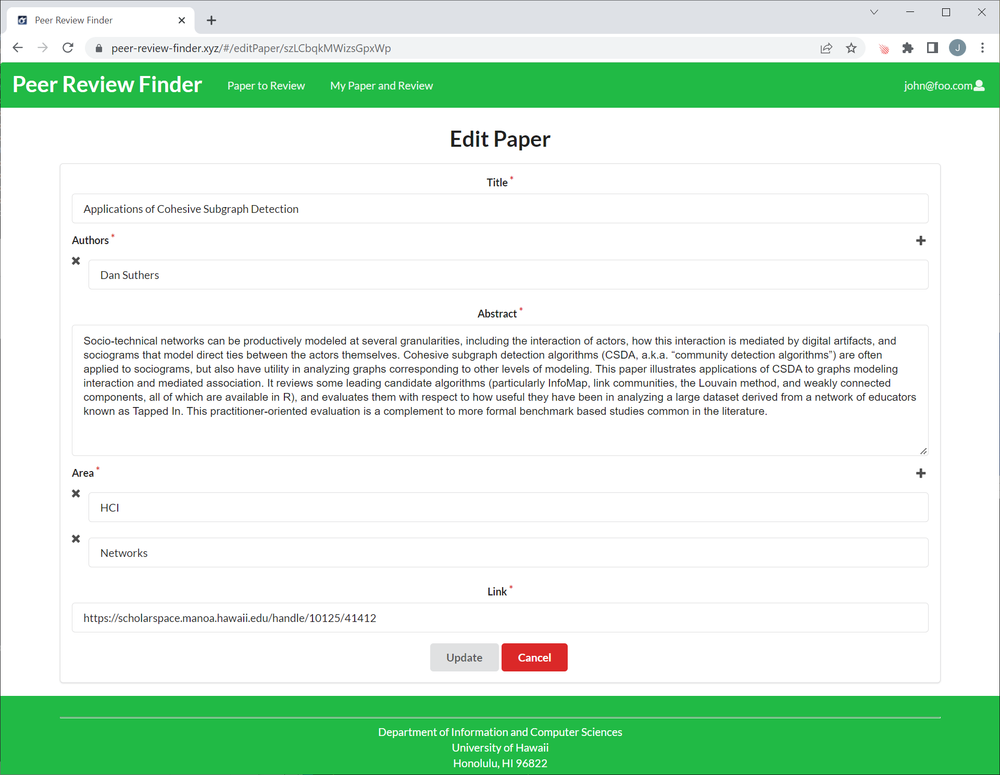


## View/Rate Review Page (Paper Owner)

By clicking on the View Review button on the View Paper Reviews page, users are able to view the review left on their paper, and rate quality of the review.

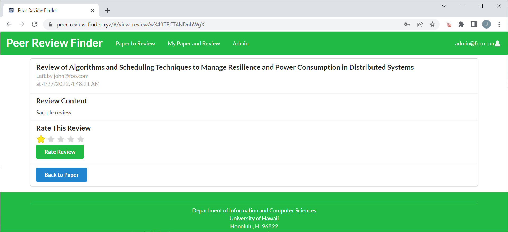


# Developer Guide

This project currently passes the Continuous Integration via Github Actions as shown by this badge: 


## Backend System

This application was built on meteor-application-template-react.  For information regarding this template, please refer to [https://ics-software-engineering.github.io/meteor-application-template-react/](https://ics-software-engineering.github.io/meteor-application-template-react/)


## Installation

First, [install Meteor](https://www.meteor.com/install).

Second, [download a copy of Peer Review Finder](https://github.com/peer-review-finder/Source-Code).

Third, cd into the app directory and install the required libraries:

```
cd /path/to/peer-review-finder
cd app
meteor npm install
```


## Running the system

Once the libraries are installed, you can run the application by invoking:

```
meteor npm run start
```


## Viewing the running app

If all goes well, the template application will appear at [http://localhost:3000](http://localhost:3000).


## ESLint

You can verify that the code obeys our coding standards by running ESLint over the code in the imports/ directory with:

```
meteor npm run lint
```


# Project Team

- [Yiwen Chen](https://yiwenc22.github.io/)
- [Derrick Luyen](https://derrickluyen.github.io/)
- [Kolwin Dixon](https://k-l-dixon.github.io/)
- [John Dobbs](https://john-dobbs.github.io/)
- [Aditi Jaiswal](https://jaiswal-aditi.github.io/)
