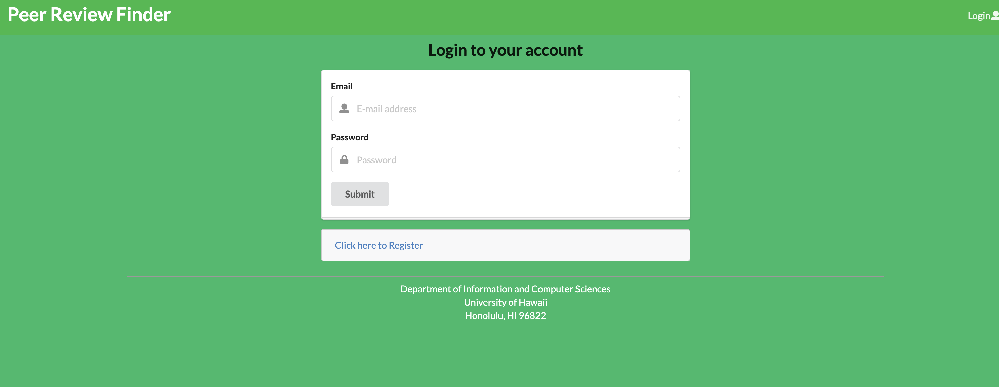
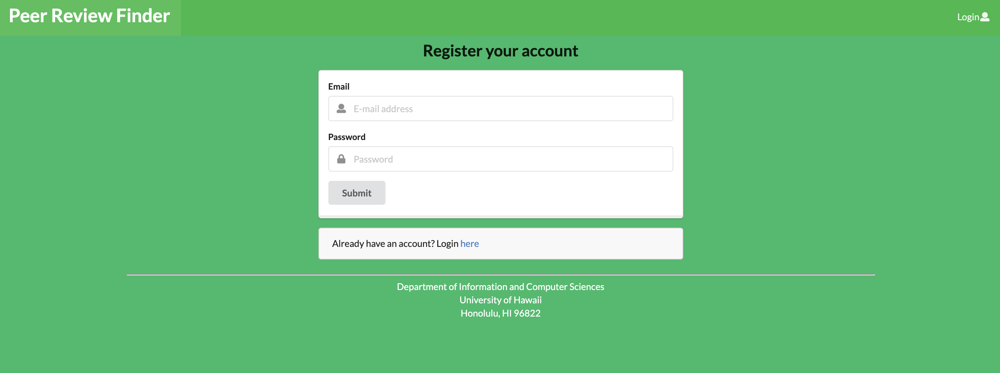
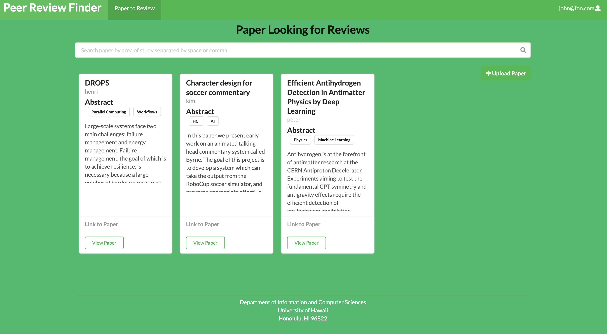
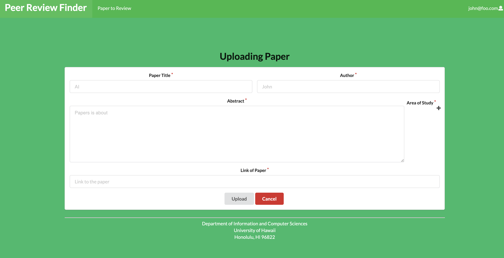
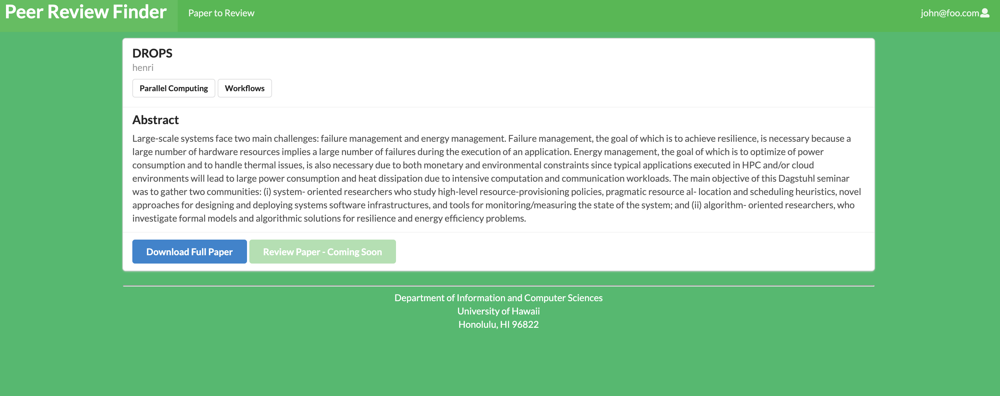

# Table of Contents

* [About Peer Review Finder](#about-peer-review-finder)
* [Deployment](#deployment)
* [User Guide](#user-guide)
* [Developer Guide](#developer-guide)
* [Project Team](#project-team)


# About Peer Review Finder

* [Live Demo](https://peer-review-finder.xyz)
* [GitHub Organization](https://github.com/peer-review-finder)
* [Team Contract](https://docs.google.com/document/d/129I7p6RzvGBnGv6KCANo64H4_rCuaIOBxddQX1s_jI8/edit?usp=sharing)
* [Project Board Milestone 1 (Completed)](https://github.com/peer-review-finder/Source-Code/projects/1)
* [Project Board Milestone 2 (Completed)](https://github.com/peer-review-finder/Source-Code/projects/2)
* [Project Board Milestone 3 (In Progress)](https://github.com/peer-review-finder/Source-Code/projects/3)

## The Problem

Journal editors and conference chairs find it increasingly difficult to find reviewers for publication manuscripts. At the same time, researchers receive an overwhelming number of invitations to review papers.


## The Solution

We propose a platform that better matches papers for review with potential reviewers by pooling researchers with similar interests together. Editors/chairs can post abstracts in need of review and researchers can select abstracts of papers they'd like to review.


# Deployment

We are using DigitalOcean for deployment of this application.

[Live Demo](https://peer-review-finder.xyz)


# User Guide

The following sections describe the main features of this application as of Milestone 1.


## Landing Page

New users are first taken to a landing page.  Here users see a brief description of features within the application.  A Login link is provided on the top right of the page to allow existing users to login with their profile or for new users to register and setup a profile setup page.


## Login Page

Clicking on the Login link and then on the Sign In menu item, you will receive the following page:




## Register Page

Clicking on the Login link and then on the Sign Up menu item, you will receive the following page:




## Landing Page After Login (General User)

A successful login brings users to the following page:


## Paper Listing Page (All Users)

By clicking "Paper to Review" in the NavBar, users are able to see papers that are available to review.  Papers available are listed with a brief abstract along with a link to view each paper and an "Upload Paper" button to the right and under the search bar:




## Add Paper Page (All Users)

Clicking the "Upload Paper" button on the [Paper Listing page](#paper-listing-page-all-users) allows users to add a new paper:




## View Paper Page (All Users)

Clicking the "View Paper" button on the [Paper Listing page](#paper-listing-page-all-users) allows users to see a full abstract of a particular paper along with a link to download the full paper:




# Developer Guide

This project currently passes the Continuous Integration via Github Actions as shown by this badge: 


## Backend System

This application was built on meteor-application-template-react.  For information regarding this template, please refer to [https://ics-software-engineering.github.io/meteor-application-template-react/](https://ics-software-engineering.github.io/meteor-application-template-react/)


## Installation

First, [install Meteor](https://www.meteor.com/install).

Second, [download a copy of Peer Review Finder](https://github.com/peer-review-finder/Source-Code).

Third, cd into the app directory and install the required libraries:

```
cd /path/to/peer-review-finder
cd app
meteor npm install
```


## Running the system

Once the libraries are installed, you can run the application by invoking:

```
meteor npm run start
```


## Viewing the running app

If all goes well, the template application will appear at [http://localhost:3000](http://localhost:3000).


## ESLint

You can verify that the code obeys our coding standards by running ESLint over the code in the imports/ directory with:

```
meteor npm run lint
```


# Project Team

- [Yiwen Chen](https://yiwenc22.github.io/)
- [Derrick Luyen](https://derrickluyen.github.io/)
- [Kolwin Dixon](https://k-l-dixon.github.io/)
- [John Dobbs](https://john-dobbs.github.io/)
- [Aditi Jaiswal](https://jaiswal-aditi.github.io/)
