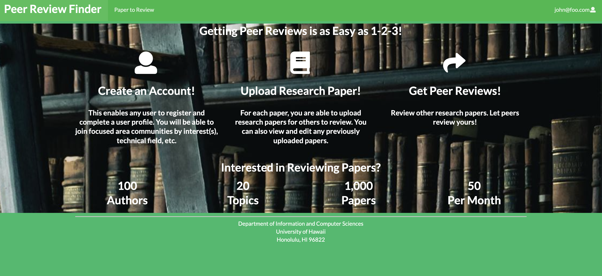

 
## Table of Contents
 

* [Overview](#overview)
* [Peer Review Finder](#covid-check)
* [User Manual](#user-manual)
* [The Team](#the-team)

## Overview
The problem: Journal editors and conference chairs find it increasingly difficult to find reviewers for publication manuscripts. At the same time, researchers receive an overwhelming number of invitations to review papers.

The solution: We propose a platform that better matches papers for review with potential reviewers by pooling researchers with similar interests together. Editors/chairs can post abstracts in need of review and researchers can select abstracts of papers they’d like to review.

## Peer Review Finder

## User Manual
## Landing Page
New users are first taken to a landing page.  Here users see a brief description of features within the application.  A Login link is provided on the top right of the page to allow existing users to login with their profile or for new users to register and setup a profile setup page.   

## User Home Page

"Sign Up" brings users to sign in page to register an email and password:   

  

"Sign In" brings users to a similar page which users use thier registered email and password to sign in with their profile:   

A successful login brings users to the following page:   

## Listing Page
By cliking "Paper to Review" in the NavBar, users are able to see papers that are available to review.  Papers availble are listed with a brief abstract along with a link to view each paper and an "Upload Paper" link to the right and under the search bar:  

  

Selecting "view paper" allows users to see a full abstract of a particular paper along with a link to download the full paper:   

  

## Project Team
- [Yiwen Chen](https://yiwenc22.github.io/)
- [Derrick Luyen](https://derrickluyen.github.io/)
- [Kolwin Dixon](https://k-l-dixon.github.io/)
- [John Dobbs](https://john-dobbs.github.io/)
- [Aditi Jaiswal](https://jaiswal-aditi.github.io/)

### [Team Contract](https://docs.google.com/document/d/129I7p6RzvGBnGv6KCANo64H4_rCuaIOBxddQX1s_jI8/edit)
### [Deployment](http://159.65.97.195/)
### [M1](https://github.com/peer-review-finder/Source-Code/projects/1)
### [M2](https://github.com/peer-review-finder/Source-Code/projects/2)
